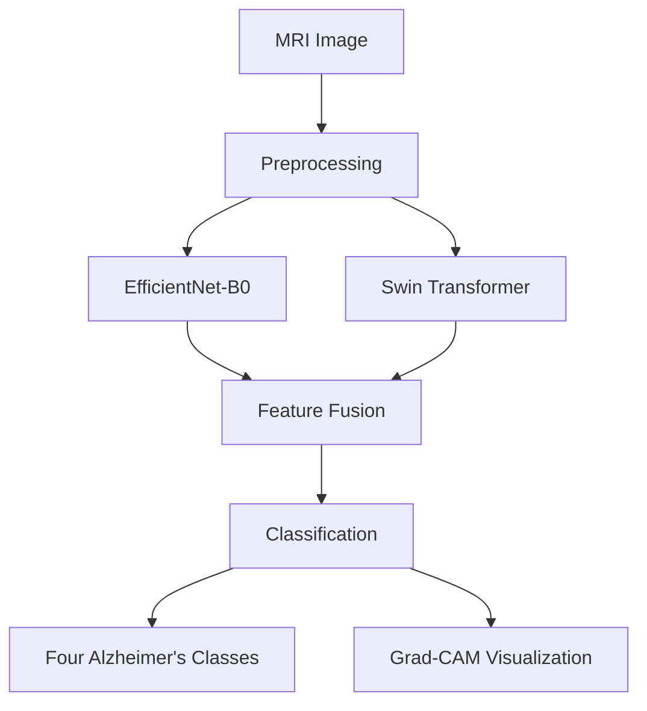

# NeuroInsight-XAI

### Hybrid CNN–Vision Transformer for Alzheimer's Disease Prediction from MRI Images


## Overview

NeuroInsight-XAI is a Flask-based web application that uses a hybrid **EfficientNet-B0 + Swin Transformer** deep learning architecture to classify MRI images into four Alzheimer's disease categories. The system achieves a test accuracy of **97.24%** and includes Grad-CAM visualization for explainable AI insights.

> This project is intended for research and educational purposes and should not be used as a medical diagnostic tool.

## Features

- MRI image upload
- Four-class Alzheimer's prediction
- Hybrid EfficientNet-B0 + Swin Transformer model
- Grad-CAM visualization
- Flask web interface
- PyTorch inference
- Simple and user-friendly interface

## Technology Stack

| Category        | Technology              |
| --------------- | ----------------------- |
| Language        | Python                  |
| Backend         | Flask                   |
| Deep Learning   | PyTorch                 |
| CNN             | EfficientNet-B0         |
| Transformer     | Swin Transformer        |
| Explainability  | Grad-CAM                |
| Frontend        | HTML5, CSS3, JavaScript |
| Version Control | Git & GitHub            |
| Large Files     | Git LFS                 |

## System Architecture



## Dataset

- **Total images:** 44,029
- **Image type:** MRI brain images
- **Image size:** 224 × 224
- **Dataset split:** 80% Training / 10% Validation / 10% Testing

### Classes

| Class              |
| ------------------ |
| Non-Demented       |
| Very Mild Demented |
| Mild Demented      |
| Moderate Demented  |

## Performance

### Test Accuracy

> **97.24%**

| Class              | Precision | Recall | F1-Score |
| ------------------ | --------: | -----: | -------: |
| Mild Demented      |      0.97 |   0.99 |     0.98 |
| Moderate Demented  |      1.00 |   1.00 |     1.00 |
| Non-Demented       |      0.97 |   0.95 |     0.96 |
| Very Mild Demented |      0.95 |   0.96 |     0.95 |

## Installation

```bash
git clone https://github.com/sarthakbarange/Alzheimer_Prediction.git
cd Alzheimer_Prediction
```

Create a virtual environment:

```bash
python -m venv venv
source venv/bin/activate  # On Windows: venv\Scripts\activate
```

Install dependencies:

```bash
pip install -r requirements.txt
```

Install Git LFS and pull model files:

```bash
git lfs install
git lfs pull
```

## Usage

Start the Flask application:

```bash
python app.py
```

The application will start at `http://localhost:5000`

1. Open the local Flask URL in your browser
2. Upload an MRI image
3. Generate the prediction
4. View the result and Grad-CAM visualization

## Project Structure

```text
Alzheimer_Prediction/
│
├── Backend/
│   ├── best_model.pth
│   └── model_scripted.pt
│
├── Frontend/
│   ├── index.html
│   ├── style.css
│   └── script.js
│
├── app.py
├── requirements.txt
├── .gitignore
├── .gitattributes
└── README.md
```

## Note

This project is developed for research and educational purposes. The predictions should not be considered a substitute for professional medical diagnosis.
